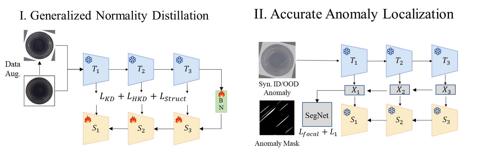

<h2 align="center">
2nd Place of CVPR 2024 VAND2.0 Challenge: Generalized Normality Learning for Robust Anomaly Detection
</h2>


## 🔥 Honor
2nd Place of CVPR 2024 VAND2.0 Challenge:
- Workshop Link: https://sites.google.com/view/vand-2-0-cvpr-2024/home
- Challenge Link：https://www.hackster.io/contests/openvino2024

## Overview
Anomaly detection is a crucial task that learns normal patterns from training samples to identify abnormal samples in test data. **However, existing approaches often encounter challenges in real-world scenarios due to data drift resulting from external factors such as changes in camera angles, lighting conditions, and noise.** In this work, we propose a robust anomaly detection model via Generalized Normality Learning (GNL) to deal with the domain shift. The key to our robustness to domain shift is to enhance the recall of out-of-distribution samples. The work is built based on [ADshfit](https://github.com/mala-lab/ADShift) and [DestSeg](https://github.com/apple/ml-destseg). First, we train a normality distillation student to fit diverse augmented normal patterns, in which we adopt a [hard distillation loss](https://github.com/Hui-design/AAND) and a [structure distillation loss](https://arxiv.org/abs/2402.17091). Second, to enhance the accuracy of anomaly localization, we adopt a [segmentation sub-network](https://github.com/mala-lab/ADShift) to integrate the outputs of teacher and student models. Experiments on the MvTec AD test set with random perturbations highlight the effectiveness of our method. If you find this work helpful, please give us your star.


<div align="center">
  
</div>


## 🔧  Installation

Please use the following command for installation.

```bash
# It is recommended to create a new environment
conda create -n AAND python==3.8
conda activate AAND

pip install torch==1.11.0+cu113 torchvision==0.12.0+cu113 torchaudio==0.11.0 --extra-index-url https://download.pytorch.org/whl/cu113

# Install packages and other dependencies
pip install -r requirements.txt
```


## 💾 Dataset

- [MVTec AD](https://www.mvtec.com/company/research/datasets/mvtec-ad)
- [DRAEM_dtd](https://www.robots.ox.ac.uk/~vgg/data/dtd/), used as the auxillary texture datasets for synthesizing anomalies like [DRAEM](https://github.com/VitjanZ/DRAEM). 

## Preprocess
Generate corrupted_mvtec test set like [ADshift](https://github.com/mala-lab/ADShift) using generate_corrupted_mvtec.py, in which we have added rotation corruptions:
```bash
python generate_corrupted_mvtec.py --data_path <your_path>/mvtec/  
```


## 🚅 Training
You can train models on mvtec, VisA, or mvtec3d by the following commands:
```bash
python train_mvtec_DINL.py --data_root <your_path>/mvtec/  
python train_Seg.py --data_root <your_path>/mvtec/ --aux_path <your_path>/dtd/images
```


## ⛳ Testing
You can test the trained models by the following commands:
```bash
python inference_mvtec_ATTA.py --data_root <your_path>/mvtec/    
```

## Citation
```bibtex
@misc{VAND-GNL,
  author = {Canhui Tang, Sanping Zhou, Mang Cao, Le Wang, Hao Sun},
  title = {VAND-GNL},
  howpublished = {\url{https://github.com/Hui-design/VAND-GNL}},
  year = {2025},
}
```


## Acknowledgements
- [ADshift](https://github.com/mala-lab/ADShift)
- [DestSeg](https://github.com/apple/ml-destseg)
- [AAND](https://github.com/Hui-design/AAND)


